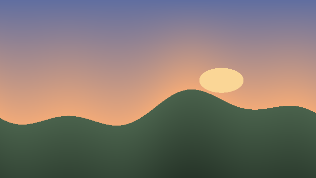
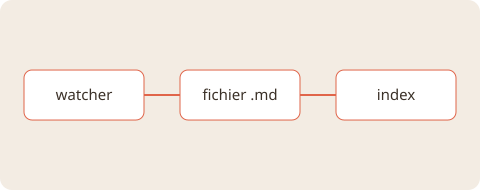

# Rythme vertical
#tests/rythme #ursa

Chaque ligne de cette note doit tomber sur la réglure de 28 px, quels que soient la police et la taille choisies. Ce paragraphe est assez long pour revenir à la ligne plusieurs fois dans la colonne de texte, avec du **gras**, de l'_italique_, du `code inline`, un [lien](https://example.com), un [[Voyage au Japon]] et du ==surlignage==.

Une ligne avec des pastilles #idée #voyages/japon-2026 #liste de courses# et un emoji 🐻.

## Titre de niveau 2
### Titre de niveau 3
#### Titre de niveau 4
##### Titre de niveau 5
###### Titre de niveau 6

Titre Setext
============

Sous-titre Setext
-----------------

- Premier élément
- Deuxième élément, assez long pour revenir à la ligne dans la colonne et vérifier l'alignement des lignes de continuation
  - Sous-élément
    - Sous-sous-élément
1. Numéroté
2. Encore
   1. Imbriqué

- [ ] Tâche
- [x] Tâche faite
  - [ ] Sous-tâche

> Une citation d'une ligne.

> Une citation sur plusieurs lignes, assez longue pour revenir à la ligne dans la colonne de texte et vérifier son rembourrage.
> Deuxième ligne de la citation.
>
> > Citation imbriquée.

```ts
const rythme = 28;
// Une ligne de code très longue qui revient à la ligne dans le bloc pour vérifier que la hauteur totale reste un multiple de l'unité.
export function aligner(hauteur: number): number {
  return Math.ceil(hauteur / rythme) * rythme;
}
```

```
```

    code indenté
    sur deux lignes

---

***

Texte après le séparateur.

| Colonne | Valeur |
|---|---|
| Tableau | brut |

## Images

Une image plus large que la colonne, ramenée à sa largeur :



Une image verticale à 220 px, puis une petite image à sa taille naturelle, collées l'une à l'autre :

{width=220}


Un schéma SVG (affiché par une balise image, jamais injecté) :

{width=430}

Une URL seule sur sa ligne (carte d'aperçu si le réglage est activé) :

https://example.com/articles/rythme-vertical

Un PDF joint :

[devis-renovation.pdf](assets/devis-renovation.pdf)

Fin de la note.
